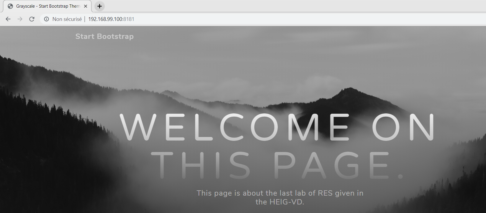

## Step 1: Static HTTP server with apache httpd

1. Créer une branche `fb-apache_static`

2. Créer un dossier `/docker-images/static-image`

3. Faire du dossier `static-image` l'emplacement courant

4. Créer un Dockerfile avec le contenu suivant :

   ```bash
   FROM php:7.2-apache
   
   COPY src/ /var/www/html
   ```
   
5. Créer le dossier `/docker-images/static-image/src`

6. Chercher un template [bootstrap](https://startbootstrap.com/themes/). Nous avons choisi le template "Grayscale". Le télécharger puis le mettre dans le dossier `/docker-images/static-image/src`. Il faut le customiser en gardant seulement certaine partie et en changeant les textes

7. Revenir dans le dossier `static-image`

9. Construire l'image Docker avec la commande :

   ```bash
   $ docker build -t res/static_app .
   ```

10. Tester l'image Docker avec la commande :

    ```bash
    $ docker run -p 8181:80 res/static_app
    ```
    
    Tester en tapant 192.168.99.100:8181 dans le navigateur, comme ceci:
    
    

