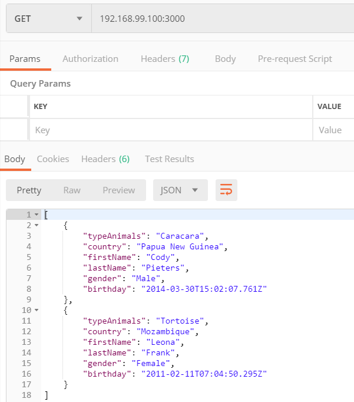

## Step 2: Dynamic HTTP server with express.js

1. Créer une branche `fb-express-dynamic`

2. Créer un dossier `/docker-images/dynamic-image`

3. Faire du dossier `dynamic-image` l'emplacement courant

4. Créer un Dockerfile avec le contenu suivant :

   ```bash
   FROM node:10.15
   
   COPY src /opt/app
   WORKDIR /opt/app
   RUN npm install
   
   CMD ["node", "/opt/app/index.js"]
   ```

4. Créer le dossier `/docker-images/dynamic-image/src`

5. Faire du dossier `src` l'emplacement courant

6. Initialiser node js dans le dossier avec `npm init`, initialiser le package.json :

   ```bash
   {  "name": "animals",
     "version": "0.1.0",
     "description": "Labs",
     "main": "index.js",
     "scripts": {
       "test": "echo \"Error: no test specified\" && exit 1"
     },
     "author": "Monthoux, Poulard",
     "license": "ISC"
   }
   ```

5. Ajouter la dépendance `Chance` avec la commande :

   ```bash
   $ npm install --save chance
   ```

6. Ajouter la dépendance `Express` avec la commande :

   ```bash
   $ npm install --save express
   ```

7. Créer le fichier `index.js` suivant :

   ```javascript
   var Chance = require('chance');
   var chance = new Chance();
   
   var express = require('express')
   var app = express();
   
   app.get('/', function(req, res){
   	res.send(generateAnimals());
   });
   
   app.listen(3000, function(){
   	console.log('Accepting HTTP requests on port 3000.');
   });
   
   function generateAnimals(){
   	var numberOfAnimals = chance.integer({
   		min: 0,
   		max: 5
   	});
   	var animals= [];
   	for (var i = 0; i < numberOfAnimals; ++i){
   		var gender= chance.gender();
   		var animal= chance.animal();
   		var country= chance.country({ full: true });
   		var birthYear = chance.year({
   			min: 2010,
   			max: 2019
   		});
   		animals.push({
   			typeAnimals: animal,
   			country: country,
   			firstName: chance.first({
   				gender: gender
   			}),
   			lastName: chance.last(),
   			gender: gender,
   			birthday: chance.birthday({
   				year: birthYear
   			})
   		});
   	};
   	console.log(animals);
   	return animals;
   }
   ```

8. Revenir dans le dossier `dynamic-image`

9. Construire l'image Docker avec la commande :

   ```bash
   $ docker build -t res/dynamic_app .
   ```

10. Tester l'image Docker avec la commande :

    ```bash
    $ docker run -p 3000:3000 res/dynamic_app
    ```

    
    
    