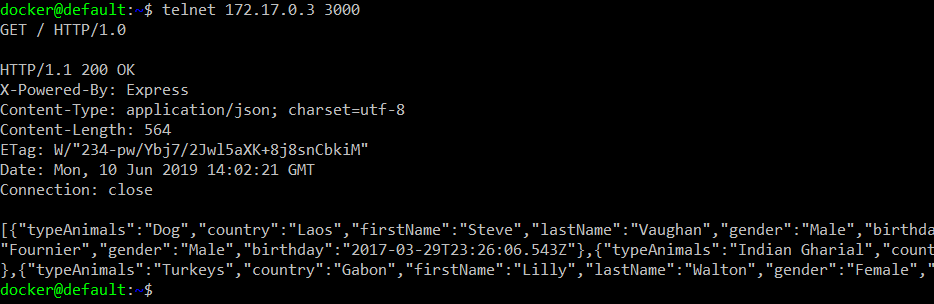
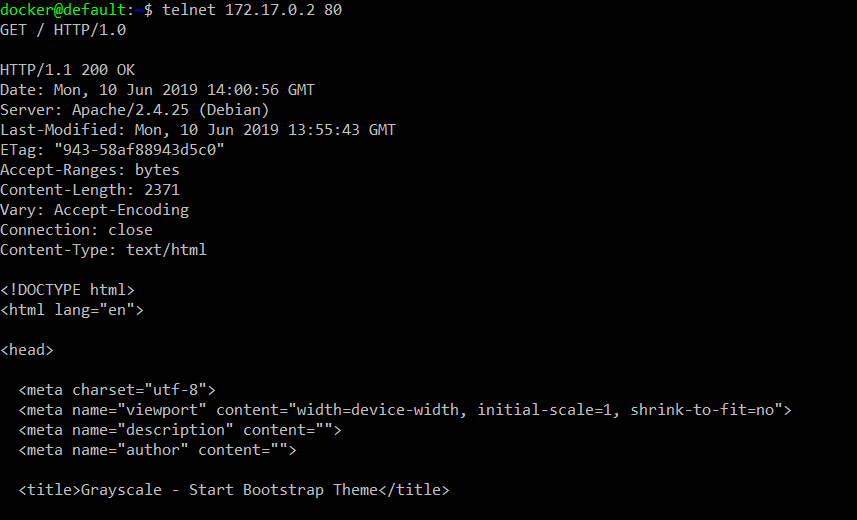
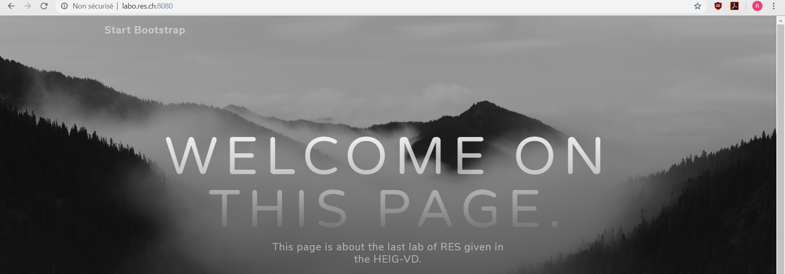
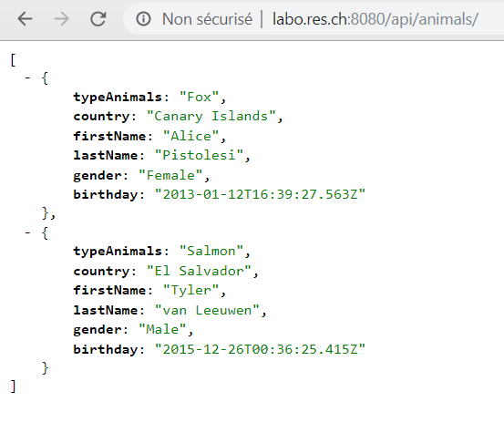

## Step 3: Reverse proxy with apache (static configuration)

1. Créer une branche `fb-reverse-proxy`

2. Lancer les deux conteneurs (httpd et node) en leur donnant un nom permettant de les identifier facilement :

   ```bash
    $ docker run -d --name static res/static_app
   ```

   ```bash
    $ docker run -d --name dynamic res/dynamic_app
   ```

3. Récupérer les adresses IP des deux conteneurs avec la commande : 

   ```bash
   $ docker inspect <nom_du_container | grep IPAddress
   ```

4. Se connecter à `docker-machine` avec la commande :

   ```bash
   $ docker-machine ssh
   ```

5. Vérifier que les conteneurs fonctionnent bien avec les commandes : 

   ```bash
   $ telnet 172.17.0.2 80
   GET / HTTP/1.0
   ```

   ```bash
   $ telnet 172.17.0.3 3000
   GET / HTTP/1.0
   ```

   Si les réponses obtenues sont les suivantes, c'est que tout s'est bien passé.

   

   

6. Créer le dossier `/docker-images/reverse-image`

7. Se rendre dans le dossier `reverse-image`

8. Créer un `Dockerfile` selon le modèle suivant :

   ```bash
   FROM php:7.2-apache
   
   COPY conf/ /etc/apache2
   
   RUN a2enmod proxy proxy_http
   RUN a2ensite 000-* 001-*
   ```

9. Créer les dossiers `/docker-images/reverse-image/conf/sites-available`

10. Se rendre dans le dossier `sites-available`

11. Créer les deux fichiers de configuration suivants :

    * 000-default.conf

    ```bash
    <VirtualHost *:80>
    </VirtualHost>
    ```

    * 001-reverse-proxy.conf

    ```bash
    <VirtualHost *:80>
      ServerName labo.res.ch
    
    
      ProxyPass "/api/animals/" "http://172.17.0.3:3000/"
      ProxyPassReverse "api/animals/" "http://172.17.0.3:3000/"
    
      ProxyPass "/" "http://172.17.0.2:80/"
      ProxyPassReverse "/" "http://172.17.0.2:80/"
    
    </VirtualHost>
    ```

12. Revenir dans le dossier `/docker-images/reverse-image/`

13. Créer l'image Docker suivante :

    ```bash
    $ docker build -t res/reverse_app .
    ```

14. Ajouter une entrée dans le fichier `hosts` de l'ordinateur afin de résoudre notre nom DNS :

    ```bash
    192.168.99.100	labo.res.ch
    ```

15. Lancer tous les conteneurs en prêtant attention à l'ordre de démarrage :

    ```bash
    $ docker run -d --name static res/static_app
    $ docker run -d --name dynamic res/dynamic_app
    $ docker run -d -p 8080:80 --name reverse res/reverse_app
    ```

16. Tester en tapant le lien suivant dans le navigateur :

    ```bash
    labo.res.ch:8080
    ```

    Si tout va bien, le site devrait apparaître comme suit :

    

    

    Nous pouvons également tester le lien suivant pour visualiser les messages JSON :

    ```bash
    labo.res.ch:8080/api/animals
    ```

    

    

