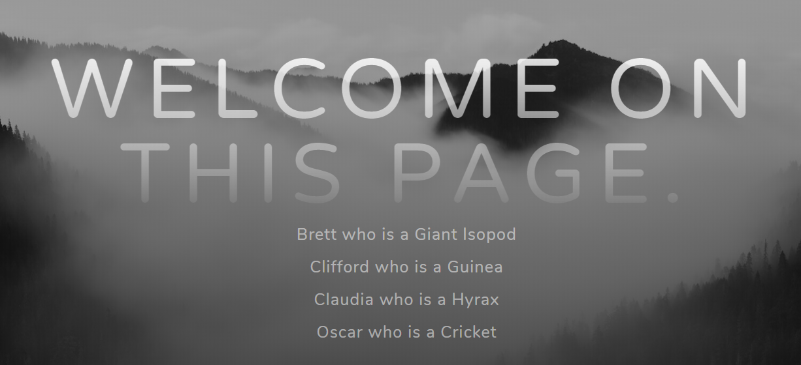

# Step 4: AJAX requests with JQuery

1. Créer une branche `fb-ajax`

2. Permettre l'installation de `vim` dans les 3 images. Pour ce faire, ajouter la ligne suivante dans chaque Dockerfile (`/docker-image/dynmic-image`, `/docker-image/reverse-image`, `/docker-image/static-image`) :

   ```bash
   RUN apt-get update && apt-get install -y vim
   ```

3. Relancer les 3 conteneurs suivants dans l'ordre :

   ```bash
   $ docker run -d --name static res/static_app
   $ docker run -d --name dynamic res/dynamic_app
   $ docker run -d -p 8080:80 --name reverse res/reverse_app
   ```

4. Vérifier que `vim` est installé sur les 3 conteneur. Pour cela, se connecter sur chaque conteneur à l'aide de la commande :

   ```bash
   $ docker exec -it <nomConteneur> /bin/bash
   ```

   Puis, une fois sur la machine, lancer la commande :

   ```bash
   $ vim test
   ```

   Si `vim` s'ouvre, c'est qu'il s'est installé correctement.

5. Stopper les 3 conteneurs et les supprimer en utilisant les commandes suivantes :

   ```bash
   $ docker stop static
   $ docker stop dynamic
   $ docker stop reverse
   $ docker rm static
   $ docker rm dynamic
   $ docker rm reverse
   ```

6. Créer le fichier `docker-images/static-image/src/js/animals.js` et y ajouter le code suivant :

   ```javascript
   $(function() {
   
      console.log("Loading animals");
      function loadAnimals() {
          $.getJSON("/api/animals/", function( animals){
            console.log(animals);
            $("#customContent").empty();
            var message ="";
            if( animals.length > 0){
              for( var i = 0; i < animals.length ; ++i){
                message += "<p>" + animals[i].firstName + " who is a " + animals[i].typeAnimals + "</p>";
              }
            }else{
              message = "No animals are there";
            }
          $("#customContent").append(message);
        });
      };
    loadAnimals();
    setInterval( loadAnimals, 5000);
   });
   ```

7. Dans le fichier `docker-images/static-image/src/index.html`, ajouter la ligne suivante à la fin du fichier :

   ```html
   <script src="js/animals.js"></script>
   ```

   Nous avons également ajouté un ID à la balise dans laquelle nos animaux seront ajoutés. Le nom de la balise doit être `customContent` afin de correspondre au nom se trouvant dans `animals.js`.
   
8. Il faut ensuite reconstruire l'image. Se rendre dans le dossier `docker-images/static-image` puis effectuer la commande : 

   ```bash
   $ docker build -t res/static_app .
   ```

9. Puis, pour tester ce qui a été fait, il faut démarrer les conteneurs dans l'ordre suivant:

   ```bash
   $ docker run -d --name static res/static_app
   $ docker run -d --name dynamic res/dynamic_app
   $ docker run -d -p 8080:80 --name reverse res/reverse_app
   ```

   Enfin, se rendre sur la page [statique](http://labo.res.ch:8080). Le résultat doit être notre page statique avec des noms d'animaux qui changent toutes les 5 secondes.

   
