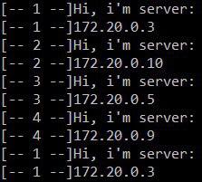

# Load balancing: multiple server nodes

1. Création d'une branche `fb-load-balancing`

2. Création du fichier `docker-compose.yml` avec comme contenu:

   ```
   version: '3'
   
   services:
     reverse-proxy:
       image: traefik # The official Traefik docker image
       container_name: reverse
       restart: always
       command: --api --docker # Enables the web UI and tells Traefik to listen to docker
       ports:
         - "80:80"     # The HTTP port
         - "443:443"
         - "8080:8080" # The Web UI (enabled by --api)
       volumes:
         - /var/run/docker.sock:/var/run/docker.sock # So that Traefik can listen to the Docker events
         - ./traefik.toml:/traefik.toml
         - ~/data/traefik/acme.json:/acme.json
       networks:
         - web
   
     apache_static:
       image: res/static_app
       build:
         context: ./docker-images/static-image
         dockerfile: Dockerfile
       labels:
         - "traefik.frontend.rule=Host:labo.res.ch"
         - "traefik.docker.network=web"
         - "traefik.port=80"
       expose:
         - "80"
       networks:
         - web
   
     express_dynamic:
       image: res/dynamic_app
       build:
         context: ./docker-images/dynamic-image
         dockerfile: Dockerfile
       labels:
         - "traefik.frontend.rule=Host:labo.res.ch; PathPrefixStrip:/api/animals"
         - "traefik.docker.network=web"
         - "traefik.port=3000"
       expose:
         - "3000"
       networks:
         - web
   
   
   networks:
     web:
       external: true
   ```

3. Création d'un network docker avec la commande `docker network create web`

4. Lancement du test avec la commande `docker-compose up -d --scale apache_static=4 --scale express_dynamic=4`. Cette commande va lancer 4 conteneur statique et 4 conteneur dynamique et les reverse proxy qui est géré par traefik. En allant sur la page  [du conteneur static](http://labo.res.ch/) on va avoir une alerte qui va nous indiquer sur quel serveur statique on est arrivé. Pour test le loadbalancing des nœud expresse il faut faire la commande 

   ```bash
   docker logs -f --tail=30 teachingheigvdres2019labohttpinfra_express_dynamic_1 | sed -e 's/^/[-- 1 --]/' & docker logs -f --tail=30 teachingheigvdres2019labohttpinfra_express_dynamic_2 | sed -e 's/^/[-- 2 --]/' & docker logs -f --tail=30 teachingheigvdres2019labohttpinfra_express_dynamic_3 | sed -e 's/^/[-- 3 --]/' & docker logs -f --tail=30 teachingheigvdres2019labohttpinfra_express_dynamic_4 | sed -e 's/^/[-- 4 --]/'
   ```

   Il faut remplacer les `teachingheigvdres2019labohttpinfra_express_dynamic_x` par le nom des conteneurs. Cela va afficher une ces informations qui vont se mettre a jour lorsque une requetes ajax est faites aux noeuds.

   